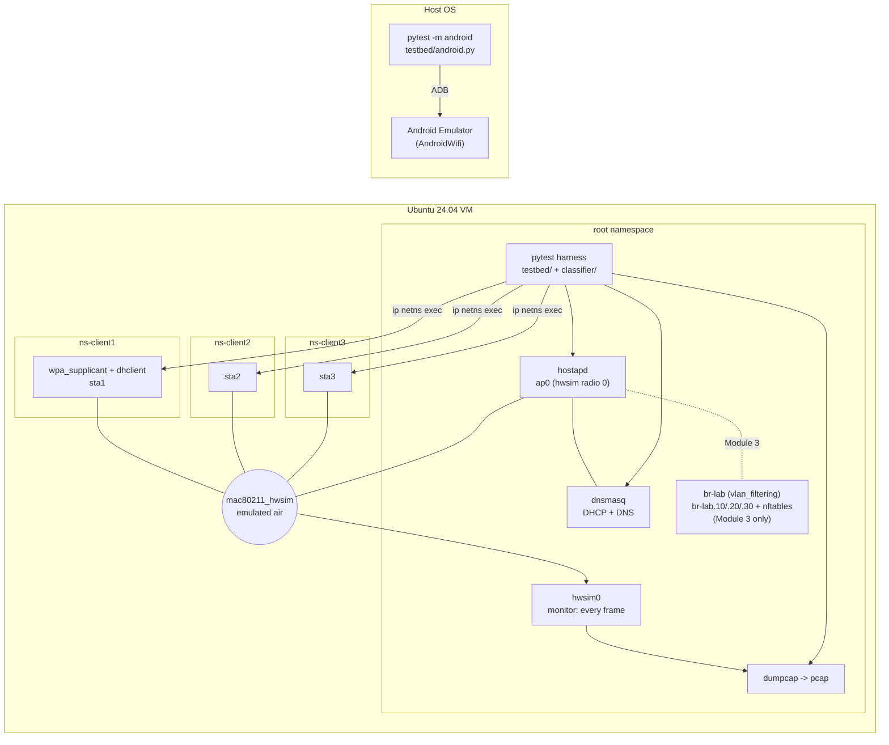

# Architecture



## Why namespaces

Each client radio lives in its own network namespace. Without that, the kernel would route
client-to-AP traffic over loopback, skipping the emulated air, DHCP and the 802.11 data path.
With it, a client's only route out is its `staN` interface.

## Data flow of one test

1. `hostap.ensure()` renders `configs/hostapd/ap.conf.j2` and starts hostapd on `ap0`.
2. The `capture` fixture starts `dumpcap` on `hwsim0` for the test.
3. `WifiClient.join()` renders `configs/wpa_supplicant/client.conf.j2`, starts wpa_supplicant in
   the client's namespace, waits for `COMPLETED`, then runs dhclient, `dig`, `ping`.
4. Logs + pcap are copied to `reports/artifacts/<test>/` and linked from the HTML report.
5. Module 2 runs `classifier/classify_join.py` on the pcap and asserts the stage.

## Module 3 topology

```
 sta (lab-mgmt)   sta (lab-test)   sta (lab-iot)
       |                |                |
      ap0            ap0v20           ap0v30        <- one BSS per SSID (hostapd bss=)
       | PVID 10        | PVID 20        | PVID 30
       +--------------- br-lab ----------+          <- VLAN-filtering bridge = managed switch
                          |
          br-lab.10   br-lab.20   br-lab.30          <- gateways .1, dnsmasq per subnet
                          |
            nftables inet labfw (forward/input)      <- lab/nftables/vlan-policy.nft
```
